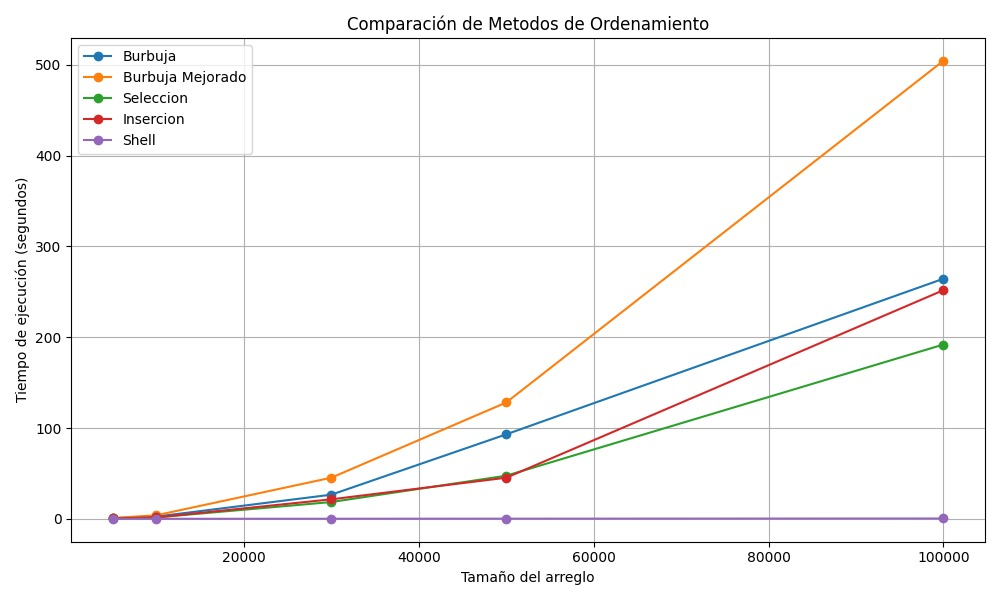

# Práctica 4.2 – Algoritmos de Ordenamiento

**Asignatura:** Estructura de Datos  
**Carrera:** Computación  
**Estudiantes:** Gordillo Tenemaza Carlos Antonio, Esteban Vicente Pesantez Rea  
**Docente:** Ing. Pablo Torres  
**Fecha de entrega:** Domingo 11 de Marzo

---

## Repositorio del Proyecto

[https://github.com/PRESTEBAN/ICC-EST-U1-TRABAJO_GRUPAL_GORDILLO_PESANTEZ](https://github.com/PRESTEBAN/ICC-EST-U1-TRABAJO_GRUPAL_GORDILLO_PESANTEZ)

---

## Descripción del Proyecto

Este proyecto consiste en la implementación de cinco métodos de ordenamiento en Python: Burbuja, Burbuja Mejorado, Selección, Inserción y ShellSort. El objetivo es medir el **tiempo de ejecución** de cada uno al ordenar arreglos de diferentes tamaños y analizar su rendimiento en base a la **notación Big-O**.

Para garantizar una comparación justa, todos los métodos trabajan sobre arreglos con los mismos valores (clonados antes de cada ejecución), y cada tamaño es una extensión del anterior.

---

## Métodos de Ordenamiento Implementados

- `Burbuja`
- `Burbuja Mejorado`
- `Seleccion`
- `Insercion`
- `Shell Sort`

---

## Tamaños de Entrada

Los métodos fueron ejecutados sobre arreglos aleatorios de los siguientes tamaños:

- 5.000 elementos
- 10.000 elementos
- 30.000 elementos
- 50.000 elementos
- 100.000 elementos

---

## Resultados de Tiempo de Ejecución

| Tamaño del Arreglo | M. Burbuja   | M. Burbuja Mejorado  | M. Selección   | M. Inserción   | M. Shell      |
|--------------------|--------------|----------------------|----------------|----------------|---------------|
| 5,000              | 0.657121 seg | 0.932258 seg         | 0.393956 seg   | 0.384776 seg   | 0.010698 seg  |
| 10,000             | 2.483774 seg | 3.931273 seg         | 1.582511 seg   | 1.560112 seg   | 0.026153 seg  |
| 30,000             | 26.581341 seg| 45.286588 seg        | 18.495874 seg  | 21.484285 seg  | 0.103545 seg  |
| 50,000             | 93.001657 seg| 128.080622 seg       | 47.463645 seg  | 45.259699 seg  | 0.177563 seg  |
| 100,000            | 264.370204 seg| 504.367987 seg      | 191.908132 seg | 251.751111 seg | 0.380647 seg  |

---

- **Eje X:** Tamaño del arreglo  
- **Eje Y:** Tiempo de ejecución en segundos  
- Cada línea representa un algoritmo distinto.

---

## Captura de Pantalla del Código en Ejecución

---

## Conclusiones

**Estudiante 1 – Gordillo Tenemaza Carlos Antonio**

Al comparar los diferentes métodos de ordenamiento, se pudo observar que el método **ShellSort** es el más eficiente, especialmente cuando se trabaja con listas grandes. Gracias a su menor complejidad, aproximadamente `O(n log² n)` dependiendo de la secuencia de incrementos utilizada, logra reducir significativamente el tiempo de ejecución frente a los otros métodos.

Por otro lado, el método de **Burbuja Mejorado** no superó al **Burbuja Simple**; de hecho, en nuestras pruebas tuvo un peor desempeño, lo que confirma que ambos mantienen una complejidad de `O(n²)`, poco recomendable para volúmenes de datos altos.

Los métodos de **Inserción** y **Selección** ofrecieron resultados muy parecidos entre sí. Ambos también tienen una complejidad de `O(n²)`, lo cual los hace útiles únicamente para listas pequeñas, ya que su rendimiento cae rápidamente cuando se incrementa el tamaño de los datos.

En resumen, **ShellSort** fue la mejor opción para ordenar grandes cantidades de datos, mientras que los otros algoritmos son más adecuados en contextos de bajo volumen o para fines educativos.

**Estudiante 2 – Esteban Vicente Pesantez Read**

- El algoritmo de **ShellSort**, a pesar de la gran entrada de datos dispuestos, mostró superioridad con respecto al tiempo, debido al tiempo de ejecución y a su funcionalidad que se encarga de dividir al arreglo en varias partes. Se concluye que este algoritmo tiene una complejidad O`(n log² n)`, lo cual es del tipo complejidad promedio. Comparando con el resto de algoritmos, los cuales tienen una complejidad de `O(n²)` debido a que en dichos algoritmos se hace uso de varios ciclos for, lo cual define su complejidad en gran medida.

Desde otra perspectiva´, comparando los algoritmos de **Burbuja Mejorado** y **Burbuja Simple**; se concluye que no existe una gran diferencia en su desempeño debido a su complejidad `O(n²)`. Tienen tiempos de ejecución similares que pueden variar; incluso el Burbuja Simple, en ciertas ocasiones, es capaz de superar al Burbuja Mejorado.

En cuanto a los algoritmos de **Inserción** y **Selección** poseen un rendimiento que es ligeramente mejor, igualmente con complejidad `O(n²)`, sin embargo no representa mejoras significativas entre sí.
---

## Recomendaciones

- No usar algoritmos cuadráticos como Burbuja, Selección o Inserción para arreglos con más de 10.000 elementos.
- Asegurarse siempre de clonar el arreglo antes de pasarlo a cada método de ordenamiento.
- Usar funciones de temporización como `time.time()` para medir de forma precisa el rendimiento.
- Dividir el código en funciones bien definidas para facilitar su lectura y mantenimiento.

---

